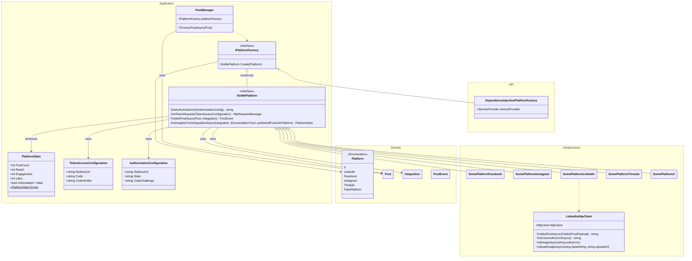

## Platforms

```mermaid
---
config:
    class:
        hideEmptyMembersBox: true
---
classDiagram
    namespace Application {
        class PostManager {
            -IPlatformFactory platformFactory
            +ProcessPostAsync(Post)
        }

        class ISoMePlatform {
            <<Interface>>
            GetAuthorizationUrl(AuthorizationConfig) string
            GetTokenRequest(TokenAccessConfiguration) HttpRequestMessage
            PublishPostAsync(Post, Integration) PostEvent
            GetInsightsFromIntegrationAsync(Integration, IEnumerable~Post~ publishedPostsOnPlatform) PlatformStats
        }

        class PlatformStats {
            +int PostCount
            +int Reach
            +int Engagement
            +int Likes
            +bool IsSimulated = false

            +PlatformStats Empty$
        }

        class TokenAccessConfiguration {
            +string RedirectUrl
            +string Code
            +string CodeVerifier
        }
        
        class AuthorizationConfiguration {
            +string RedirectUrl
            +string State
            +string CodeChallenge
        }

        class IPlatformFactory {
            <<Interface>>
            ISoMePlatform Create(Platform)
        }
    }

    namespace Domain {
        class Platform{
            <<Enumeration>>
            X
            LinkedIn
            Facebook
            Instagram
            Threads
            FakePlatform
        }

        class Post
        class Integration
        class PostEvent
    }

    namespace API {
        class DependencyInjectionPlatformFactory {
            -IServiceProvider serviceProvider
        }
    }

    namespace Infrastructure {
        class SomePlatformFacebook {
            
        }
        class SomePlatformInstagram {
            
        }
        class SomePlatformLinkedIn {
            
        }

        class LinkedInHttpClient {
            -HttpClient httpClient
            ~PublishPostAsync(PublishPostPayload) string
            ~GetUserAuthorUrnAsync() string
            ~InitImageAsync(string authorUrn)
            ~UploadImageAsync(string base64Img, string uploadUrl)
        }     

        class SomePlatformThreads {
            
        }
        class SomePlatformX {
            
        }
    }
    
    PostManager --> Post : uses
    PostManager ..> IPlatformFactory

    ISoMePlatform --> AuthorizationConfiguration : uses
    ISoMePlatform --> TokenAccessConfiguration : uses
    ISoMePlatform --> Post : uses
    ISoMePlatform --> Integration : uses
    ISoMePlatform --> PlatformStats : produces

    SomePlatformLinkedIn ..> LinkedInHttpClient

    IPlatformFactory o-- ISoMePlatform : constructs
    IPlatformFactory --> Platform
    IPlatformFactory <|-- DependencyInjectionPlatformFactory

    ISoMePlatform <|-- SomePlatformFacebook
    ISoMePlatform <|-- SomePlatformInstagram
    ISoMePlatform <|-- SomePlatformLinkedIn
    ISoMePlatform <|-- SomePlatformThreads
    ISoMePlatform <|-- SomePlatformX
```