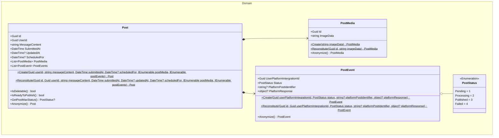

```mermaid
classDiagram
    namespace Domain {
        class Post {
            +Guid Id
            +Guid UserId
            +string MessageContent
            +DateTime SubmittedAt
            +DateTime? UpdatedAt
            +DateTime? ScheduledFor
            +List~PostMedia~ PostMedia
            +List~PostEvent~ PostEvents

            +Create(Guid userId, string messageContent, DateTime submittedAt, DateTime? scheduledFor, IEnumerable<PostMedia> postMedia, IEnumerable<PostEvent> postEvents)$ Post
            +Reconstitute(Guid id, Guid userId, string messageContent, DateTime submittedAt, DateTime? updatedAt, DateTime? scheduledFor, IEnumerable<PostMedia> postMedia, IEnumerable<PostEvent> postEvents)$ Post
            +IsDeletable() bool
            +IsReadyToPublish() bool
            +GetPostMaxStatus() PostStatus?
            +Anonymize() Post
        }

        class PostMedia {
            +Guid Id
            +string ImageData

            +Create(string imageData)$ PostMedia
            +Reconstitute(Guid id, string imageData)$ PostMedia
            +Anonymize() PostMedia
        }

        class PostEvent {
            +Guid UserPlatformIntergrationId
            +PostStatus Status
            +string? PlatformPostIdentifier
            +object? PlatformResponse

            +Create(Guid userPlatformIntegrationId, PostStatus status, string? platformPostIdentifier, object? platformResponse)$ PostEvent
            +Reconstitute(Guid id, Guid userPlatformIntegrationId, PostStatus status, string? platformPostIdentifier, object? platformResponse)$ PostEvent
            +Anonymize() PostEvent
        }

        class PostStatus {
            <<Enumeration>>
            Pending = 1
            Processing = 2
            Published = 3
            Failed = 4
        }
    }

    Post *--> PostMedia
    Post *--> PostEvent
    PostEvent o-- PostStatus
```