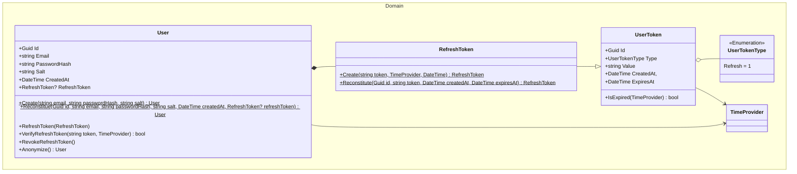

```mermaid
classDiagram
    namespace Domain {
        class User {
            +Guid Id
            +string Email
            +string PasswordHash
            +string Salt
            +DateTime CreatedAt
            +RefreshToken? RefreshToken

            +Create(string email, string passwordHash, string salt)$ User
            +Reconstitue(Guid id, string email, string passwordHash, string salt, DateTime createdAt, RefreshToken? refreshToken)$ User

            +RefreshToken(RefreshToken)
            +VerifyRefreshToken(string token, TimeProvider) bool
            +RevokeRefreshToken()
            +Anonymize() User
        }

        class UserToken{
            +Guid Id
            +UserTokenType Type
            +string Value
            +DateTime CreatedAt,
            +DateTime ExpiresAt

            +IsExpired(TimeProvider) bool
        }

        class RefreshToken {
            +Create(string token, TimeProvider, DateTime)$ RefreshToken
            +Reconstitute(Guid id, string token, DateTime createdAt, DateTime expiresAt)$ RefreshToken
        }

        class UserTokenType {
            <<Enumeration>>
            Refresh = 1
        }

        class TimeProvider

    }

    User *-- RefreshToken
    RefreshToken --|> UserToken
    UserToken o-- UserTokenType
    User --> TimeProvider
    UserToken --> TimeProvider
```