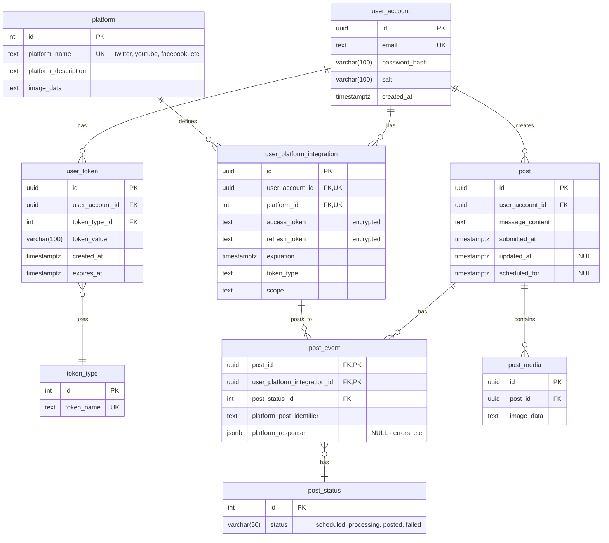

# ER Diagram

```mermaid
erDiagram
    user_account ||--o{ user_platform_integration : "has"
    user_account ||--o{ post : "creates"
    user_account ||--o{ user_token : "has"
    user_token }o--|| token_type : "uses"
    post ||--o{ post_event : "has"
    post_event }o--|| post_status : "has"
    post ||--o{ post_media : "contains"
    platform ||--o{ user_platform_integration : "defines"
    user_platform_integration ||--o{ post_event : "posts_to"

    user_account {
        uuid id PK
        text email UK
        varchar(100) password_hash
        varchar(100) salt
        timestamptz created_at 
    }

    user_token {
        uuid id PK
        uuid user_account_id FK
        int token_type_id FK
        varchar(100) token_value
        timestamptz created_at
        timestamptz expires_at
    }

    token_type {
        int id PK
        text token_name UK
    }

    platform {
        int id PK
        text platform_name UK "twitter, youtube, facebook, etc"
        text platform_description
        text image_data
    }

    user_platform_integration {
        uuid id PK
        uuid user_account_id FK, UK
        int platform_id FK, UK
        text access_token "encrypted"
        text refresh_token "encrypted"
        timestamptz expiration
        text token_type
        text scope
    }

    post {
        uuid id PK
        uuid user_account_id FK
        text message_content
        timestamptz submitted_at
        timestamptz updated_at "NULL"
        timestamptz scheduled_for "NULL"
    }

    post_media {
        uuid id PK
        uuid post_id FK
        text image_data 
    }

    post_event {
        uuid post_id FK, PK
        uuid user_platform_integration_id FK, PK
        int post_status_id FK
        text platform_post_identifier 
        jsonb platform_response "NULL - errors, etc" 
    }

    post_status {
        int id PK
        varchar(50) status "scheduled, processing, posted, failed"
    }
```
