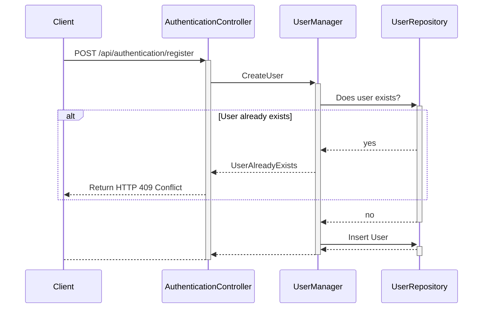
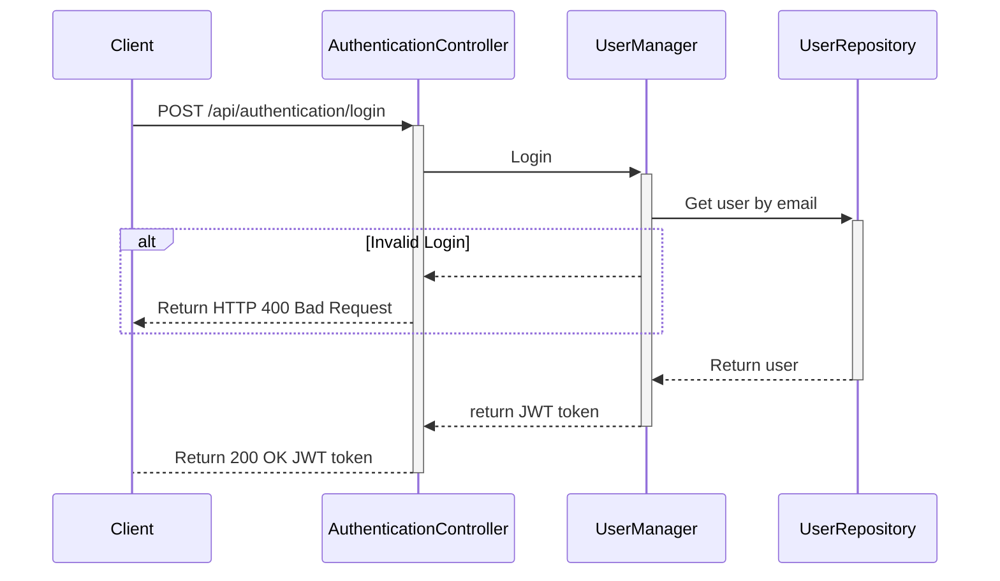
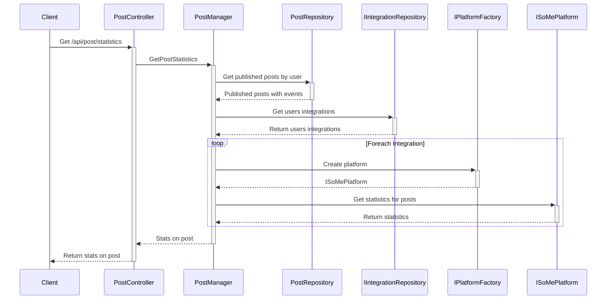
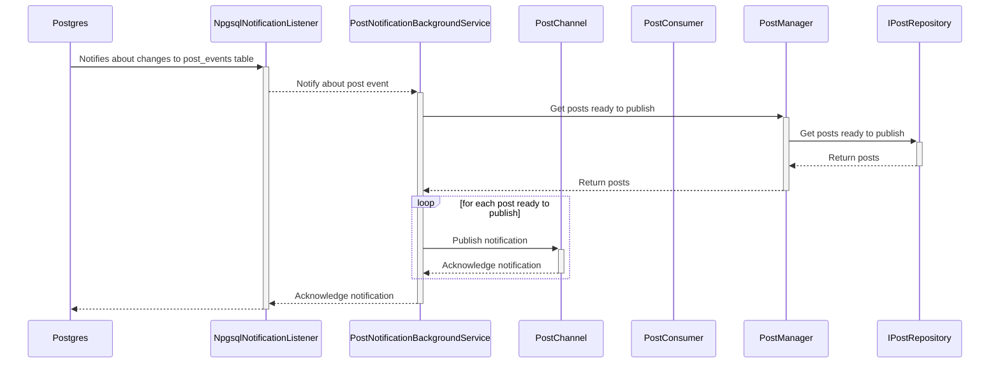
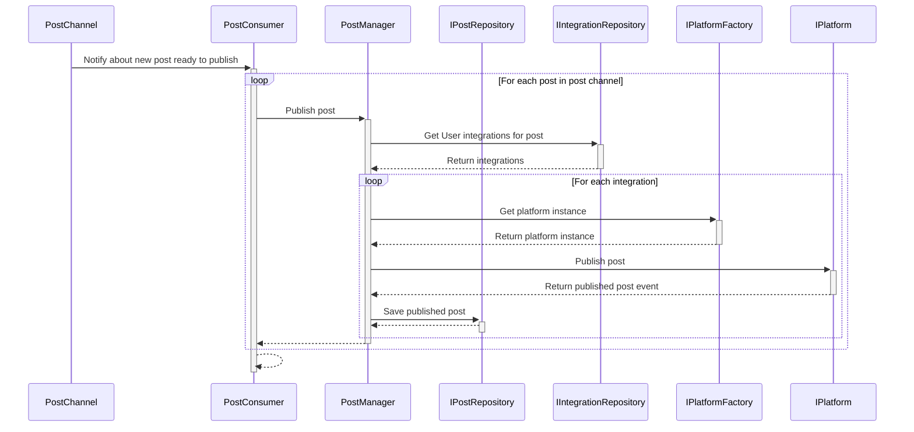

# Sequence Diagram

## Register User

```mermaid
    sequenceDiagram
    Client->>+AuthenticationController: POST /api/authentication/register
    AuthenticationController->>+UserManager: CreateUser 
    UserManager ->>+ UserRepository: Does user exists?
    alt User already exists
        UserRepository-->>UserManager: yes
        UserManager -->> AuthenticationController: UserAlreadyExists
        AuthenticationController -->> Client: Return HTTP 409 Conflict
    end
    UserRepository-->>-UserManager: no
    UserManager ->>+ UserRepository: Insert User
    UserRepository -->>- UserManager: 
    UserManager -->>- AuthenticationController: 
    AuthenticationController -->- Client: 
```

## Login

```mermaid
    sequenceDiagram
    Client->>+AuthenticationController: POST /api/authentication/login
    AuthenticationController->>+UserManager: Login 
    UserManager ->>+ UserRepository: Get user by email
    alt Invalid Login 
        UserManager -->> AuthenticationController: 
        AuthenticationController -->> Client: Return HTTP 400 Bad Request
    end
    UserRepository-->>-UserManager: Return user
    UserManager -->>- AuthenticationController: return JWT token
    AuthenticationController -->- Client: Return 200 OK JWT token
```

## Get Statistics On Post
Used to get statistics on post for each integration

```mermaid
sequenceDiagram
    Client->>+PostController: Get /api/post/statistics
    PostController->>+PostManager: GetPostStatistics
    PostManager ->>+ PostRepository: Get published posts by user
    PostRepository -->>- PostManager: Published posts with events
    PostManager ->>+ IIntegrationRepository: Get users integrations
    IIntegrationRepository -->>- PostManager: Return users integrations
    loop Foreach Integration
        PostManager ->>+ IPlatformFactory: Create platform
        IPlatformFactory -->>- PostManager: ISoMePlatform
        PostManager ->>+ ISoMePlatform:  Get statistics for posts
        ISoMePlatform -->>- PostManager: Return statistics
    end
    PostManager -->>- PostController: Stats on post
    PostController -->>- Client : Return stats on post
```

## Publish post

```mermaid
sequenceDiagram
    participant Postgres
    participant NpgsqlNotificationListener
    participant PostNotificationBackgroundService
    participant PostChannel
    participant PostConsumer
    participant PostManager
    participant IPostRepository

    Postgres ->>+ NpgsqlNotificationListener: Notifies about changes to post_events table
    NpgsqlNotificationListener -->>+ PostNotificationBackgroundService: Notify about post event
    PostNotificationBackgroundService ->>+ PostManager: Get posts ready to publish
    PostManager ->>+ IPostRepository: Get posts ready to publish
    IPostRepository -->>- PostManager: Return posts
    PostManager -->>- PostNotificationBackgroundService: Return posts
    loop for each post ready to publish
        PostNotificationBackgroundService ->>+ PostChannel: Publish notification
        PostChannel -->>- PostNotificationBackgroundService: Acknowledge notification
    end
    PostNotificationBackgroundService -->>- NpgsqlNotificationListener: Acknowledge notification
    NpgsqlNotificationListener -->>- Postgres:
```

#### When new post in the post channel

```mermaid
sequenceDiagram
    participant PostChannel
    participant PostConsumer
    participant PostManager
    participant IPostRepository
    participant IIntegrationRepository
    participant IPlatformFactory
    participant IPlatform

    PostChannel ->>+ PostConsumer : Notify about new post ready to publish
    loop For each post in post channel
        PostConsumer ->>+ PostManager: Publish post
        PostManager ->>+ IIntegrationRepository: Get User integrations for post
        IIntegrationRepository -->>- PostManager: Return integrations
        loop For each integration
            PostManager ->>+ IPlatformFactory: Get platform instance
            IPlatformFactory -->>- PostManager: Return platform instance
            PostManager ->>+ IPlatform: Publish post
            IPlatform -->>- PostManager: Return published post event
            PostManager ->>+ IPostRepository: Save published post
            IPostRepository -->>- PostManager:
        end
        PostManager -->>- PostConsumer:
    end
    PostConsumer -->>- PostConsumer:
```