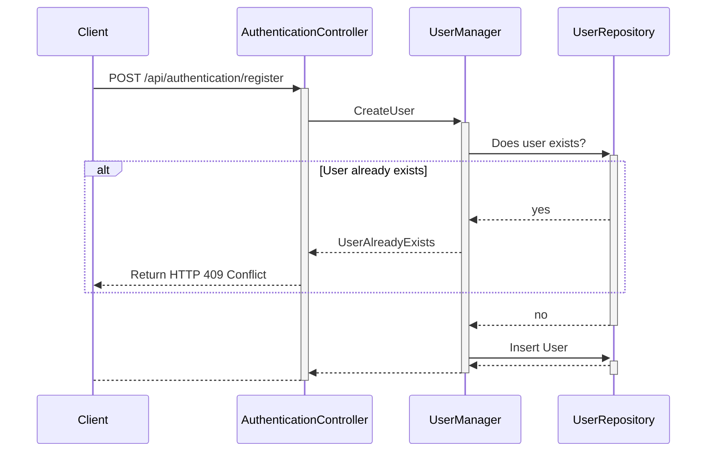
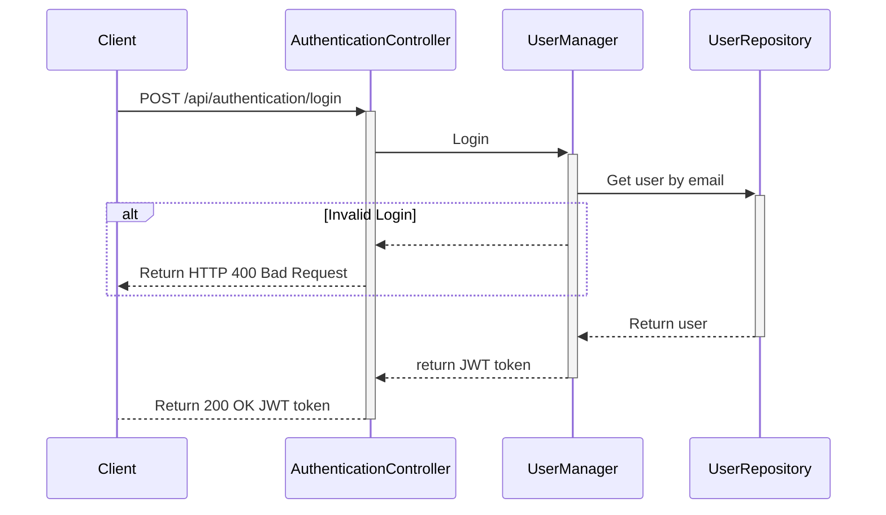
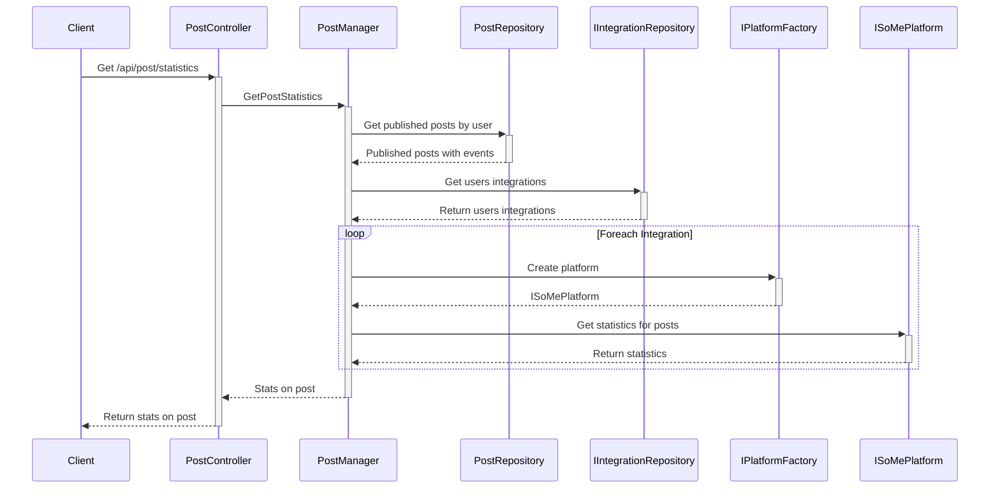

# Sequence Diagram

## Register User



## Login



## Get Statistics On Post
Used to get statistics on post for each integration



## Publish post

Used to publish post

```mermaid
sequenceDiagram
    database Client 
```
